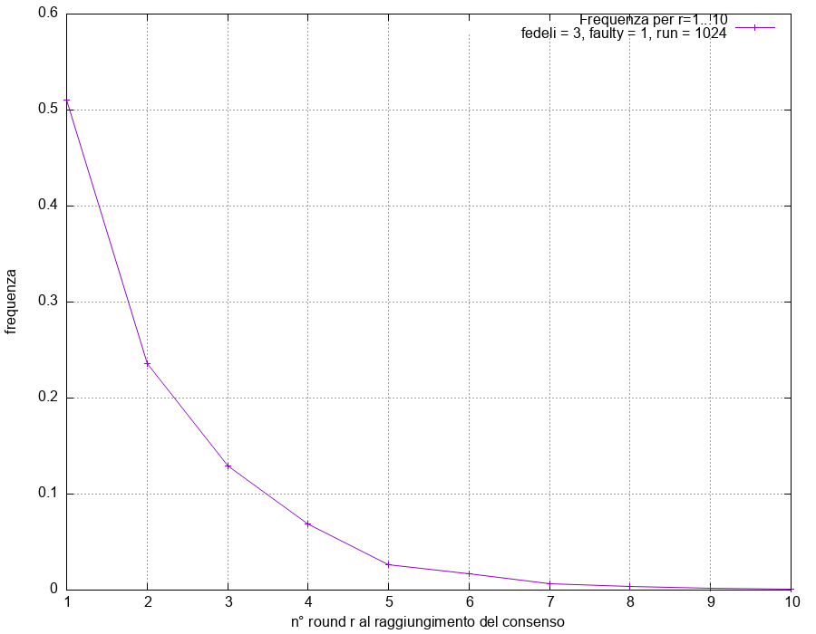

# Compito 7.1. Caso minimale di MCByzantineAgreement

Autore: Eugenio Costagliola, s5583414
Il codice è presente sia in questo documento sia al seguente link github: 

## Lista comandi (da eseguire dalla root):

- Per compilare il programma

 > make

- Per eseguire il programma:

 > ./exec

## Svolgimento

Di seguito riportata la consegna suddivisa in parti accompagnate dalla
spiegazione del lavoro svolto.

1. E' dato un sistema distribuito costituito da n = 4 processi di cui il quarto è faulty. I tre processi
affidabili seguono fedelmente il protocollo Monte Carlo mentre il processo faulty è malizioso: a
ogni round, spedisce al processo affidabile j (con j = 1,2 e 3) il bit 1−b[j]. Considera R = 2^10
run nei quali i bit iniziali sono divisi nell’unico split interessante, 2 a 1.

Codice e output in fondo.

2. Grafica la frazione dei run in cui l’accordo è raggiunto in r = 1,2,...,10 round e commenta ciò che ottieni. 



Nel grafico ('grafico.png') si osserva una distribuzione geometrica.

Una distribuzione geometrica segue P(X=k)=p(1-p)^(k-1), ovvero la probalità di avere k-1 fallimenti di fila e in seguito un successo. 

A ogni round si hanno 2 opzioni:
- il lancio della moneta coincide con maj[j], dunque l'accordo è raggiunto nel round successivo
- il lancio della moneta non coincide con maj[j], dunque i processi per cui tally[j] ≥T avranno bit diverso dai processi per cui tally[j] < T

Quindi la probabilità p di ottenere il consenso al round r è descritta da questa distribuzione.

3. Perché se in un qualche round per un processo affidabile j risulta che tally[j] ≥T e l’esito del lancio della moneta 
coincide con maj[j], nel round successivo l’accordo è certamente raggiunto?

Per ogni processo fedele si ha
- tally[j] ≥T, allora bit = valore contato in maggioranza, ovvero maj[j].
- tally[j] <T, allora bit = esito della moneta.

maj[j] è uguale per tutti perchè se così non fosse allora questi processi avrebbero almeno 2 bit diversi ma non è possibile perché il processo faulty è uno solo.

Quindi se l'esito del lancio della moneta coincide con maj[j], l'accordo sarà raggiunto perché tutti i processi avranno lo stesso bit.

## Esempio di output

Di seguito riportato un output di esecuzione.

### Output di './exec':

Terminale:

```
******* ITERAZIONE N° 0 ********
************ round n° 0 ************
moneta: 1	 bits:	1	1	0
[FAULTY] bit inviati
[FEDELE 0] bit: 1	 ricevuti: 100	 max: 0	 tally: 2
[FEDELE 1] bit: 1	 ricevuti: 100	 max: 0	 tally: 2
[FEDELE 2] bit: 0	 ricevuti: 111	 max: 1	 tally: 3
consenso raggiunto in 1 round
valore bit: 1

[ ... ]

******* ITERAZIONE N° 1023 ********
************ round n° 0 ************
moneta: 0	 bits:	1	1	0
[FAULTY] bit inviati
[FEDELE 0] bit: 1	 ricevuti: 100	 max: 0	 tally: 2
[FEDELE 1] bit: 1	 ricevuti: 100	 max: 0	 tally: 2
[FEDELE 2] bit: 0	 ricevuti: 111	 max: 1	 tally: 3
************ round n° 1 ************
moneta: 1	 bits:	0	0	1
[FAULTY] bit inviati
[FEDELE 0] bit: 0	 ricevuti: 011	 max: 0	 tally: 2
[FEDELE 1] bit: 0	 ricevuti: 011	 max: 0	 tally: 2
[FEDELE 2] bit: 1	 ricevuti: 000	 max: 0	 tally: 3
************ round n° 2 ************
moneta: 1	 bits:	1	1	0
[FAULTY] bit inviati
[FEDELE 0] bit: 1	 ricevuti: 100	 max: 0	 tally: 2
[FEDELE 1] bit: 1	 ricevuti: 100	 max: 0	 tally: 2
[FEDELE 2] bit: 0	 ricevuti: 111	 max: 1	 tally: 3
consenso raggiunto in 3 round
valore bit: 1

Il consenso è stato trovato in 1 round 523 volte
Il consenso è stato trovato in 2 round 241 volte
Il consenso è stato trovato in 3 round 132 volte
Il consenso è stato trovato in 4 round 70 volte
Il consenso è stato trovato in 5 round 27 volte
Il consenso è stato trovato in 6 round 17 volte
Il consenso è stato trovato in 7 round 7 volte
Il consenso è stato trovato in 8 round 4 volte
Il consenso è stato trovato in 9 round 2 volte
Il consenso è stato trovato in 10 round 1 volte
```

Dati per grafico:

```
3 1 1024
1 0.5107
2 0.2354
3 0.1289
4 0.0684
5 0.0264
6 0.0166
7 0.0068
8 0.0039
9 0.0020
10 0.0010
```