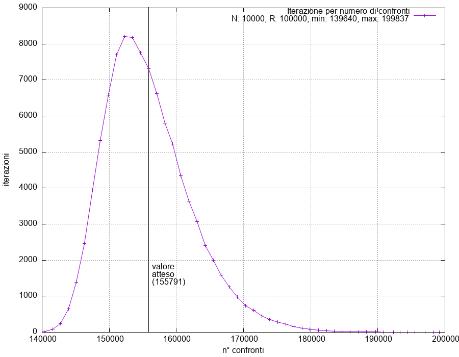

# Compito 2.1. Implementazione di LVQuickSort

Autore: Eugenio Costagliola, s5583414

## Lista comandi (da eseguire dalla root):

- Per compilare il programma

  > make

- Per eseguire il programma:

  > ./exec

- Per produrre il grafico:

  > ./grafico.bash

## Svolgimento

Di seguito riportata la consegna suddivisa in parti accompagnate dalla
spiegazione del lavoro svolto.

1.  _Costruisci una sequenza S di numeri con |S|= 10^4. Implementa LVQuickSort e conta il numero di confronti effettuati in ogni singolo run r per ordinare la sequenza S. Calcola la media empirica û del numero di confronti effettuati_

   Implementato in math.c, quicksort.c e main.c [output](#output-di-exec)

2.  _e produci un istogramma delle frequenze dei valori ottenuti identificando le posizioni di û e 2û._

    Main.c analizza la sequenza del numero di confronti e produce un file con i
    dati ricalcolati in 50 intervalli (grafico bin 50 preservato come richiesto
    dalla versione dell'anno scorso di questo esercizio).

    Il [grafico](#output-di-graficobash) è generato dallo script 'grafico.bash'.

    Il grafico presenta un asse verticale in posizione û.

    2û è fuori dominio del grafico se non osservato.

    Si nota anche che il valore ‘min’, ovvero il numero minimo di confronti ottenuto tra tutte le iterazioni, non è inferiore a nlog(n) = 132 880

3.  _Osserva quanto la distribuzione empirica dei valori sia concentrata vicino alla media empirica e quanto la disuguaglianza (2) sia decisamente pessimista._

    Nel [grafico](#output-di-graficobash) si nota che intorno all'asse verticale in posizione û si trovano i numeri di confronti maggiornmente osservati mentre allontanandosi il numero di iterazioni decresce. Si osserva quindi che la distribuzione empirica dei valori è concentrata vicino alla media empirica.

    Dopo numerose prove la frequenza osservata per 2û è zero, pertanto si conferma che la disuguaglianza (2) è decisamente pessimista.

4.  _Ipotizzando che la distribuzione empirica ottenuta sulla base dei 10^5 run sia una buona approssimazione della pmf vera, sostituisci E[X] con û, poni ϵ= 10^−5 e verifica che la disuguaglianza P(X ≥ 2û) ≤ϵ (3) è molto più precisa della (2)._

    - sostituendo: (2) P(X ≥ 311582) ≤ 0.5     (3) P(X ≥ 311582) ≤ 10^-5<br>

    - frequenza di 2û: ~0, in quanto non è mai stato osservato, si stima p(2û) = 0.<br>

    - errore assoluto del risultato della (2): 0 - 0.5 = -0.5<br>

    - errore assoluto del risultato della (3): 0 - 0.00001 = -0.00001<br>

    Pertanto si conferma che la disuguaglianza (3) è molto più precisa della
    (2).

5.  _Infine, utilizzando la disuguaglianza (3) invece della (2) calcola la probabilità con cui MCQuickSort(S, 3) ordina la sequenza S._

    MCQuickSort non ordina la sequenza se per ogni k-iterazione il numero dei confronti eccede 2û, dunque per k==3 la probabilità che MCQuickSort non ordini la sequenza è:

    P(Fail) = (10^-5)^3 = 10^-15

    Da cui:

    P(Success) = 1 - 10^15 = 0.999999999999999

6.  Reminiscenza anno precedente:

    Un'alternativa decisamente più precisa della disuguaglianza (2) è la
    disuguaglianza di Chebyshev:

    ∀ϵ>0, Pr{|X−µ|≥ϵ}≤ σ^2/ϵ^2

    Da cui si ottiene:

    Pr{X ≥2µ}≤ σ^2/µ^2

    E sostituendo con la deviazione standard e il valore atteso osservati nei
    risultati riportati sotto si ottiene la seguente stima di ϵ:

    ϵ = σ^2/µ^2 = 6485^2/155792^2 = 1.7 \* 10^-3

## Esempio di output

Di seguito riportato un output di esecuzione.

### Output di './exec':

Terminale:

```
Sequenza creata
iterazione: 0, N confronti: 147408
[...]
iterazione: 99999, N confronti: 149590
Valore atteso: 155792
Deviazione standard: 6485
Numero confronti minimo: 138996
Numero confronti massimo: 200159
Esecuzione terminata
```

Dati per grafico:

```
155792 10000 100000 138996 200159
139782 3
141098 22
142234 116
143372 399
144579 1031
145795 2016
146985 3336
148195 4975
149418 6226
150630 7502
151840 8091
153062 8168
154277 8134
155497 7638
156719 7061
157940 6237
159167 5410
160379 4534
161595 3860
162816 3117
164043 2605
165262 2038
166493 1676
167695 1403
168927 1032
170152 766
171394 605
172593 433
173826 378
175067 297
176223 238
177515 164
178710 114
179909 93
181151 58
182372 48
183563 37
184809 26
186086 23
187272 16
188558 11
189895 6
190973 0
192136 6
193114 3
194642 0
195865 0
197088 0
```

### Output di './grafico.bash':

